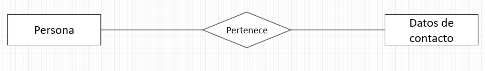

# Introducción a las bases de datos relacionales

## Entidades

Para comenzar a entender el concepto de base de datos, debemos comenzar con la unidad que la conforma, la entidad u objeto.
Hasta este punto ya debimos de haber pasado por la teoría y un poco de práctica de la programación orientada a objetos.
El paradigma de la POO nos dice que podemos tomar cualquier objeto del mundo real y representarlo de manera digital mediante el código, podemos representar también los atributos o propiedades que lo conforman, al ejercicio de convertir objetos de la vida real en objetos representados digitalmente se le denomina **Abrastacción** y es uno de los 4 fundamentos que conforman la POO.

> Las entidades se representan en plural:
>
> - Laptops
> - Automoviles
> - borregos
> - chivos
> - conejos
> - cerdos

Tenemos el ejemplo:

En una laptop tenemos los siguientes atributos:

- Color
- Año
- Modelo
- No. de serie: Atributo _"llave"_ o _"clave"_ ID (del inglés _"key"_ ), es el atributo que nos permitirá diferenciar un objeto de otro que tenga los mismos atributos
- disco duro: se representa con doble linea porque puede tener más de 1, se les denomina atributo multivaluado.
- metodo de entrada: Atributo que se conforma de otros atributos, se les denomina atributos compuestos
  - trackpad
  - teclado
- antiguedad: atributo especial que se maneja de diferente forma que las demás
- pantalla

**Los atributos llave pueden ser de dos tipos:**

- **Claves Naturales**: atributos inherentes al objeto: El número de serie en nuestro ejemplo.
- **Claves Artificiales**: clave declarada por nosotros.

## Tipos de entidades

### Entidades Fuertes

Hasta ahora hemos visto ejemplos de entidades _"fuertes"_, esto quiere decir que no necesitan de ninguna otra entidad para poder existir.

### Entidades Débiles

Pero existen otras que son exactamente lo opuesto, entidades _"débiles"_, que necesitan de otras entidades para poder existir.

Pongamos otro ejemplo:

En una biblioteca, la entidad **Ejemplares** no puede existir sin la entidad **Libros**, ya que una biblioteca no puede tener ejemplares de un libro que no existe o que no tiene ni siquiera 1 en su inventario.

Estas identidades pueden ser de dos tipos:

- Por identidad: No se diferencían entre sí, más que por la clave de su entidad fuerte.

- Por existencia: no depender de la clave de la entidad fuerte pero si de una propia, y la convierte en débil también.

## Historia de las bases de datos relacionales

En las primeras bases de datos, no tenían una forma eficiente de traer y ordenar los datos, así nacieron las RDB (Relational Data Base)

> Edgar Codd, inventor de las RDB
> Álgebra relacional

## Abstrayendo entidades

Haremos nuestra abstracción de entidades de un manejador de blogposts:

- Posts
- Usuarios
- Comentarios
- Categorías

## Relaciones

Es la manera en la que comenzamos a ligar las entidades entre sí. Para enlazarlos usamos un rombo en el diagrama.

### Cardinalidad

En las relaciones también tenemos un concepto denominado cardinalidad, el cual se refiere a cuantos de un lado pertenecen también del otro lado. Y hay de varios tipos:

#### Cardinalidad 1 a 1 (1:1)

#### Cardinalidad 0 a 1 (0:1) o 1 a 1 opcional

#### Cardinalidad 1 a Muchos (1:N)

#### Cardinalidad 0 a Muchos (0:N) 0 1 a N opcional

#### Cardinalidad Muchos a Muchos (N:N)

## Diagrama Entidad-Relación

## Diagrama Físico

### Tipo de datos

Texto | Números | Fecha/Hora | Lógicos
---------|----------|----------|-------
 CHAR(n) | INTEGER | DATE | BOOLEAN
 VARCHAR(n) | BIGINT | TIME
 TEXT | SMALLINT | DATETIME
 | | DECIMAL(n, s) | TIMESTAMP
 | | NUMERIC(n, s)

### Texto

**CHAR**: Almacena cadenas de caracteres (Memoria reservada estaticamente).
**VARCHAR**: Almacena cadenas de caracteres (Memoria reservada dinamicamente).
**TEXT**:  Cadenas de caracteres muy largas.

### Números

**INTEGER**: Número entero, no tiene fracción.
**BIGINT**: Número muy grande.
**SMALLINT**: Número menor a 99.
**DECIMAL**: n y s representa: número entero y números decimales.
**NUMERIC**: n y s representa: número entero y números decimales.

### Fecha y Hora

**DATE**: Fecha
**TIME**: Hora
**DATETIME**: Fecha y Hora, el rango admitido es de '01/01/1000 00:00:00' a '9999-12-31 23:59:59'.
**TIMESTAMP**: Fecha y hora, tiene un rango de '1970-01-01 00:00:01' GMT a '01/09/2038 03:14:07' GMT.

### Lógicos

**BOOLEAN**: Tipo de dato binario, puede tener solo dos valores, 1 o 0, verdadero o falso.

## Constrains

Son restricciones o reglas que aplicamos a la base de datos para que la información que se ingresa sea conforme a los parámetros y lineamientos de la mísma.

Constraint | Description
---------|----------
 **NOT NULL** | Se asegura que la columna no tenga valores nulos
 **UNIQUE** | Se asegura que cada valor en la columna no se repita
 **PRIMARY KEY** | Es una combinación de NOT NULL y UNIQUE
 **FOREIGN KEY** | Identifica de manera única una tupla en otra tabla
 **CHECK** | Se aseguraque el valor en la columna cumpla una condición dada
 **DEFAULT** | Coloca un valor por defecto cuando no hay un valor especificado
 **INDEX** | Se crea por columna para permitir búsquedas más rápidas

## Normalización

Nos ayuda a dejar todo en una forma normal, esto en base a las 12 leyes o mandamientos de Codd, anteriormente visto.

Llegar a normalizar una base de datos es algo comparado como a un _**Estado Zen**_, un estando en el que tu base de datos esta en un equilibrio y desprendida de redundancias.

Pero ¿qué es normalización? lo veremos con el siguiente ejercicio:

Tenemos una tabla que relaciona a alumnos con materias que cursan

ALUMNO | NIVEL_CURSO | NOMBRE_CURSO | MATERIA_1 | MATERIA_2
:---: | :---: | :---: | :---: | :---:
Juanito | Maestría | Data Enginieering | MySQL | Python
Pepito | Licenciatura | Programación | MySQL | Python

La normalización se logra a partir de una serie de reglas o normas que se denominan Formas Normales.

### Primera Forma Normal (1FN)

#### Atributos Atómicos (Sin campos repetidos)

En este caso la primera forma normal nos inidica que los atributos deben ser atómicos, es decir, que no deben de haber una redundancia en la representación que hacemos en la tabla, por lo cual nos quedaría de la siguiente forma:

ALUMNO_ID | ALUMNO | NIVEL_CURSO | NOMBRE_CURSO | MATERIA
:---: | :---: | :---: | :---: | :---:
1 | Juanito | Maestría | Data Enginieering | MySQL
1 | Juanito | Maestría | Data Enginieering | Python
2 | Pepito | Licenciatura | Programación | MySQL
2 | Pepito | Licenciatura | Programación | Python

### Segunda Forma Normal (2FN)

#### Debe cumplir la 1FN y cada campo de la tabla debe depender de una clave única

En nuestro ejemplo vemos que el id del alumno se repite dos veces cada por cada uno de los alumnos que tenemos registrados que son juanito y pepito, por tal motivo tenedremos que separar el id y generar otra tabla:

**Alumnos**:

ALUMNO_ID | ALUMNO | NIVEL_CURSO | NOMBRE_CURSO
:---: | :---: | :---: | :---:
1 | Juanito | Maestría | Data Enginieering
2 | Pepito | Licenciatura | Programación

**Materias**:

MATERIA_ID | ALUMNO_ID | MATERIA
---------|----------|---------
 1 | 1 | MySQL
 2 | 1 | Python
 3 | 2 | MySQL
 4 | 2 | Python

### Tercera Forma Normal (3FN)

#### Debe cumplir la 1FN, 2FN y los campos que NO son clave NO deben tener dependencias

**Alumnos**:

ALUMNO_ID | ALUMNO | CURSO_ID
:---: | :---: | :---:
1 | Juanito | 1
2 | Pepito | 2

**Cursos**:

CURSO_ID | NIVEL_CURSO | NOMBRE_CURSO
:---: | :---: | :---:
1 | Maestría | Data Enginieering
2 | Licenciatura | Programación

**Materias**:

MATERIA_ID | ALUMNO_ID | MATERIA
:---: | :---: | :---:
1 | 1 | MySQL
2 | 1 | Python
3 | 2 | MySQL
4 | 2 | Python

### Cuarta Forma Normal (4FN)

#### Debe cumplir la 1FN, 2FN, 3FN y los campos multivaluados se identifcan por una clave única.

**Alumnos**:

ALUMNO_ID | ALUMNO | CURSO_ID
:---: | :---: | :---:
1 | Juanito | 1
2 | Pepito | 2

**Cursos**:

CURSO_ID | NIVEL_CURSO | NOMBRE_CURSO
:---: | :---: | :---:
1 | Maestría | Data Enginieering
2 | Licenciatura | Programación

**Materias**:

MATERIA_ID | MATERIA
:---: | :---:
1 | MySQL
2 | Python
3 | MySQL
4 | Python

**Materias por Alumno**:

MPA_ID | MATERIA_ID | ALUMNO_ID
---------|----------|---------
 1 | 1 | 1
 2 | 2 | 1
 3 | 1 | 2
 4 | 2 | 2

## Normalizando PlatziBlog

### Usuarios  

**id**: _INTEGER_ **PK**  <-- Primary key  
**login**: _VARCHAR(30)_ **NN**  <-- Not null  
**password**: _VARCHAR(32)_ **NN**  <-- Not null  
**nickname**: _VARCHAR(40)_ **NN**  <-- Not null  
**email**: _VARCHAR(40)_ **NN** **UNIQUE** <-- Not null y Único  

### Posts

**id**: _INTEGER_ **PK** <-- Primary key  
**titulo**: _VARCHAR(150)_  
**fecha_publicación**: _TIMESTAMP_  
**contenido**: _TEXT_  
**estatus**: _CHAR(8)_, _CHECK(IN('activo', 'inactivo'_))

### Comentarios

**id**: _INTEGER_ **PK**  
**comentario**: _TEXT_

### Categorias
**id**: _INTEGER_  
**categoria**: _VARCHAR(30)_ 

### Etiquetas
id: _INTEGER_ **PK**  
nombre_etiqueta: _VARCHAR(30)_
